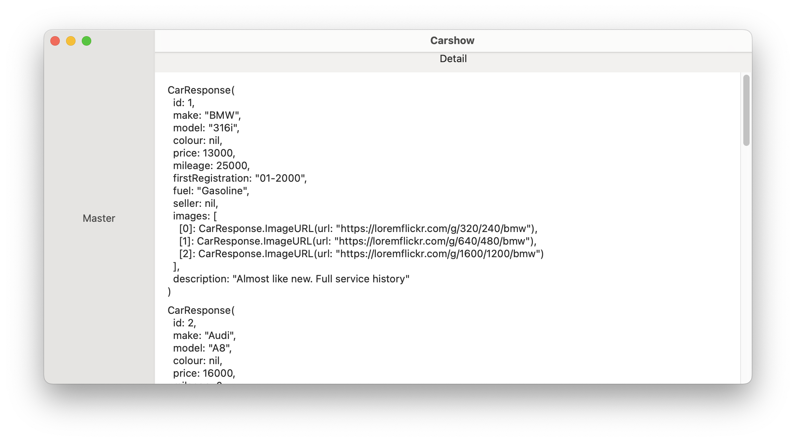

- [User Story:](#user-story)
- [Preface](#preface)
- [0 Getting request, checking, making a drawings on all I got](#0-getting-request-checking-making-a-drawings-on-all-i-got)
- [1 Creating an app, making first request inside it and display onscreen.](#1-creating-an-app-making-first-request-inside-it-and-display-onscreen)
- [2 Prototyping UI](#2-prototyping-ui)

## User Story:

As a working student, I would like to buy a decent used car without leaving my couch. To do that, I would like to be able to browse used cars on an app, with enough information for me to decide which one is best.

API + Schema
No design

---

## Preface

I consider our current feedback loop to be slow, so I would rather not come back for details. Just making my assumptions and declare some points in this file.

- Backend is out of my boundaries. I consider it a third party service where I can't change anything right now
  - In my daily job I would of course start with discussion about the user story, provided data from a backend and what would be useful.

## 0 Getting request, checking, making a drawings on all I got

Checked schema, checked details I got from a backend

- It would be a lot more cars on a real app, so
  - There should be pagination
  - I should be able to filter things via query, not locally

Checked autoscout24 filter on website. It has a lot of other fields that could help customers, but I can't add it to the api, so won't be bothered about it.

Tried to add query into request, found api docs, there is nothing to query there :)

- The images are in different sizes, that's strange. Ideally I would want to provide backend with my sizes of a view where image would fit, and it would return image with required size.
- firstRegistration format is not something I saw before. It's a month for sure, but Codable in iOS would not be able to parse it, so I would choose String and then would probably convert it into Date or format somehow. Will get to it later. String would be okay for start.
- I don't know measurement types for mileage and price. I consider it to be EUR and KM.
- We have optional fields, but nothing strange there.

Now I'll make a list of provided data and would think how it could fit into list and details screens.

Yeah, it should probably be a split view controller with master-detail views where

- List should have
  - search
  - filters
  - different states for empty search query, empty list, loading and others. Won't make error screen for networking issues in this example.
  - collection of elements displaying, probably:
    - model,make,color,registration date
    - price
    - type of seller if provided
    - mileage (if it fits)
    - fuel if it fits(icon?)
    - call button?
    - tappable card for details opening
- Details should contain all info we have on a car
  - call button
  - probably a like/subscribe button? for further searches, notifications or any other feature with subscribed cars.
  - Based on checking as24 - share?
    - Share would be great to be not just a link, but a screenshot of details view with car
  - carousel with similar cars? same model+make, probably?
- Supports iPad, macOS on Apple Silicon

What a working student and decent car in user story could mean?

- Sorting by price?
- Filtering out by price limit? Other fitlers would be less useful for a **decent** purchase

## 1 Creating an app, making first request inside it and display onscreen.

App is network based

I do want to use async await, kean/Get because I like it for simplicity. Could be simple URLSession too, but I just want to try libs I wanted to try for some time. Hope it's okay. I do see we don't need to overcomplicate, but I believe kean/Get would let me go as fast as with simple URLSession.

Will use TCA probably, cause want to use it in production right now. It will provide me with

- View layer logic
- Testability of logic (though I would probably need only hard filtering, not anything else)
- Dependency management of services (networking mainly)

SwiftUI or UIKit?

I would love to experiment and make a simple example on SwiftUI, but I think it would be better to showcase my layout skill.

So UIKit. Navigation and a details. Probably will make only some views with SwiftUI. Details screen?

Will go with iOS 15+, cause last+1 rule. It could be 14+ without issues, I think too. But just don't want to spend time checking app in iOS 14 too.

So I start with Networking and Decodable model

Filled a Decodable model using json spec.

- Spec doesn't include Seller model. Why? Filled with data I saw in response
- API resource is not secure, so I had to add App Transport Security into Info.plist
  - Taking long, cause just allowing everything doesn't work. Have to spend time on this.

Fixed in Info.plist:

```xml
<?xml version="1.0" encoding="UTF-8"?>
<!DOCTYPE plist PUBLIC "-//Apple//DTD PLIST 1.0//EN" "http://www.apple.com/DTDs/PropertyList-1.0.dtd">
<plist version="1.0">
<dict>
	<key>NSAllowsArbitraryLoads</key>
	<true/>
	<key>NSAllowsArbitraryLoadsForMedia</key>
	<true/>
</dict>
</plist>
```

And in Capabilities -> Outgoing connections (Client):


After fixes found out colour field is not in json spec too. Had to change it to optional.

Added swift-custom-dump module for better messages. It was fast.

firstRegistration in spec is required, but it's actually not present in every item.

So it's:

- Spec doesn't include Seller, colour
- Spec marks firstRegistration as required, but it's optional.

Result of first step is actually checking data is coming with macOS app :)
  

## 2 Prototyping UI

I'll start with state definition without any architecture for now

Checked docs, composable architecture for example on nav, handled mess with navigation link.

2hrs 30mins already passed

...

Made master screen with SwiftUI.
Will make details with UIKit

Navigation is now in SwiftUI, but probably I should rewrite it to UIKit that I can control well) No time for that for now.

Next steps should be:

- Details screen UI in UIKit
- Filter/search UI in List
- Filter/search logic in List
  - Should I rewrite to TCA? :)
  - Or it would be enough to just do some functions where I would control complexity with pureness. Will see.

Started working on UIKit Details version. Won't have time for carousel so would make stacks :)

Did use kean/Align cause I like it interface for speed. Made easy scrollable stack view

Decided to write a small test for view state builder and then improve it
